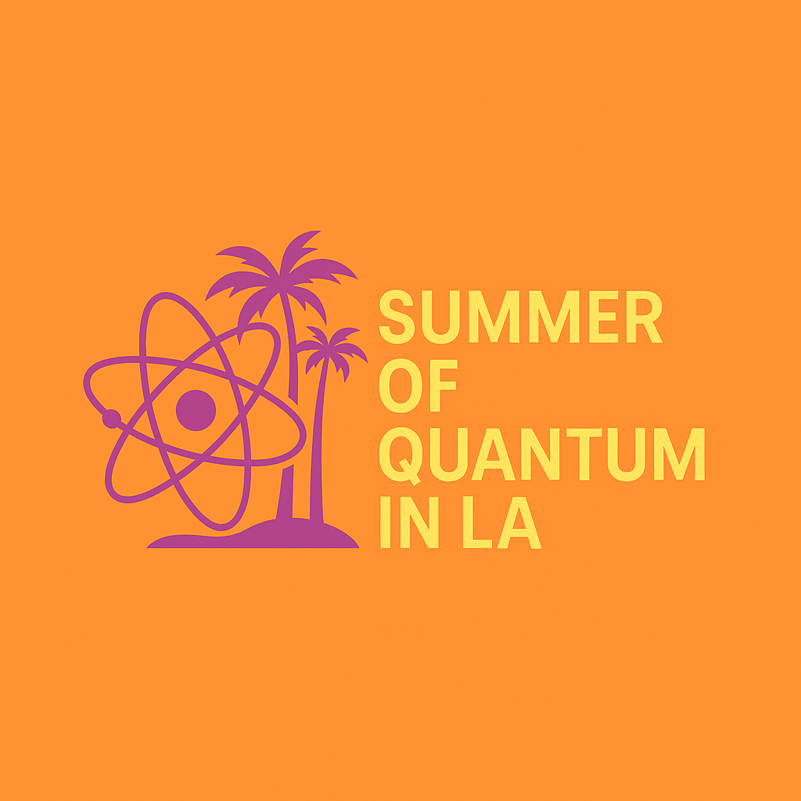

# Summer of Quantum LA 2025

The official website for the "Summer of Quantum in LA" event series.



## Project Overview

This Next.js application serves as the central hub for the "Summer of Quantum in LA" event series, featuring:

- Interactive event listings and registration
- Visually appealing UI with LA-themed elements (palm trees, Griffith Observatory)
- Neon isometric maze animation as the hero section
- Information about quantum mechanics presented in an accessible way

## Technologies Used

- **Framework:** Next.js 15
- **UI Components:** Shadcn UI with Radix UI
- **Styling:** Tailwind CSS
- **React:** React 19
- **TypeScript:** Full type support

## Getting Started

### Prerequisites

- Node.js (v18 or higher)
- pnpm (recommended) or npm

### Installation

1. Clone the repository:

   ```bash
   git clone https://github.com/shanto268/summer-of-quantum-LA-2025.git
   cd summer-of-quantum-LA-2025
   ```

2. Install dependencies:

   ```bash
   pnpm install
   # or
   npm install
   ```

3. Run the development server:

   ```bash
   pnpm dev
   # or
   npm run dev
   ```

4. Open [http://localhost:3000](http://localhost:3000) with your browser to see the result.

## Project Structure

- `/app` - Next.js app directory with main page and layout
- `/components` - Reusable UI components
  - `/ui` - Shadcn UI components
- `/public` - Static assets
- `/styles` - Global styles
- `neon-isometric-maze.tsx` - Custom canvas animation for the hero section

## How to Contribute

Contributions are welcome! Here's how you can help:

1. **Fork the repository** and create your feature branch:

   ```bash
   git checkout -b feature/amazing-feature
   ```

2. **Make your changes** - Focus on one of these areas:

   - Adding new event information
   - Improving UI components
   - Enhancing the neon isometric maze animation
   - Adding mobile responsiveness
   - Creating new pages (about, contact, event details)
   - Improving accessibility

3. **Test your changes** locally to ensure they work as expected.

4. **Commit your changes** with descriptive commit messages:

   ```bash
   git commit -m 'Add some amazing feature'
   ```

5. **Push to your branch**:

   ```bash
   git push origin feature/amazing-feature
   ```

6. **Open a Pull Request** against the main branch.

## Development Guidelines

- Follow existing code style and component patterns
- Use TypeScript for type safety
- Maintain responsive design for all screen sizes
- Ensure accessibility standards are met
- Write clean, maintainable code with appropriate comments

## License

This project is licensed under the MIT License - see the LICENSE file for details.

## Contact

Project Coordinator - [shanto@usc.edu](mailto:shanto@usc.edu)

Project Link: [https://github.com/shanto268/summer-of-quantum-LA-2025](https://github.com/shanto268/summer-of-quantum-LA-2025)
